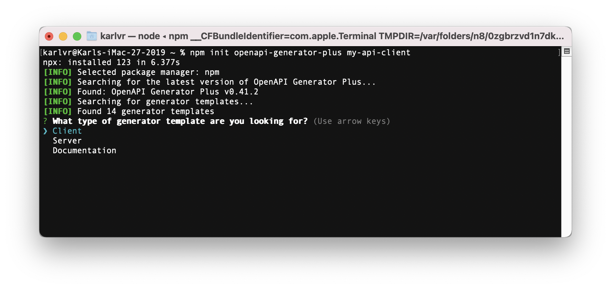
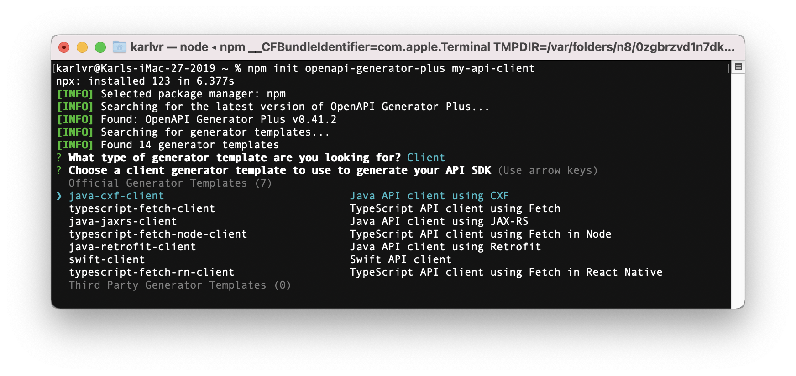
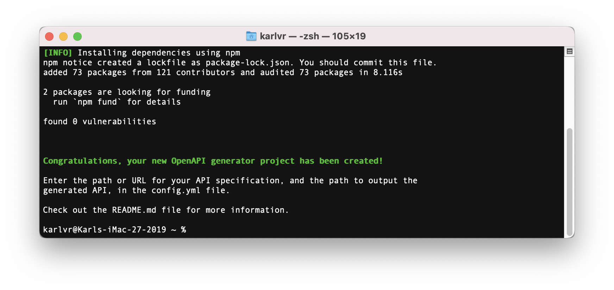
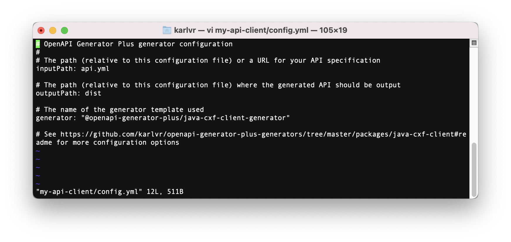

# OpenAPI Generator Plus

A code generator platform for OpenAPI 2.0 and 3.0 written in TypeScript and Node.js, with modular language-specific generator templates.

## Quick start

To create a new project to generate an API client or server in the current working directory:

```shell
npm init openapi-generator-plus
```

The script searches for the latest generator templates [available on npmjs.com](https://www.npmjs.com/search?q=keywords:openapi-generator-plus-generator).

You must first choose the type of API library you want to generate:



You will then be prompted to choose from a list of appropriate generator templates:



The script will create a `package.json` and `config.yml`, install OpenAPI Generator Plus
and the generator template, and setup a build script.



Edit the `config.yml` to point to your API specification, and where you'd like to output the generated API.



Then generate your API.

```shell
npm run generate
```

Re-run that command any time your API specification changes, or you update OpenAPI Generator Plus.

See [create-openapi-generator-plus](https://github.com/karlvr/openapi-generator-plus/tree/master/packages/create)
for more options.

## Updating

New versions of OpenAPI Generator Plus and generator templates are released from time to time. Updating to
the latest version is the same as updating dependencies in any Node.js project.

We recommend updating using [`npm-check-updates`](https://www.npmjs.com/package/npm-check-updates) by running
these commands in the generator project directory:

```shell
npx npm-check-updates -u
npm install
```

Then regenerate:

```shell
npm run generate
```

## Using

You can specify basic options on the command-line:

```shell
npx openapi-generator-plus [-c <config file>] [-o <output dir>] [-g <generator template name or path>] [<path or url to api spec>]
```

You can also use a config file, which contains more advanced options to control the generated output:

```shell
npx openapi-generator-plus -c <config file>
```

## Generator template

OpenAPI Generator Plus requires a generator template in order to generate code in your target language and style.

You can find generator templates by searching for the [#openapi-generator-plus-generator](https://www.npmjs.com/search?q=keywords:openapi-generator-plus-generator) keyword on npm.

For example, to install a generator for a [Java server using the CXF library with CDI](https://github.com/karlvr/openapi-generator-plus-generators/tree/master/packages/java-cxf-cdi-server):

```shell
npm install --save-dev @openapi-generator-plus/java-cxf-cdi-server-generator
```

### Using a generator template

Each generator template has different configuration, which you can determine from the generator's README.

First try running without any configuration:

```shell
npm openapi-generator-plus -o build -g @openapi-generator-plus/java-cxf-cdi-server-generator api.yml
```

### Command-line options

Options to the generation process can be specified on the command-line or in a configuration file.

|Option|Description|
|------|-----------|
|`-c <path>`|The path to a configuration file to load (see below)|
|`-o <path>`|The path to the output directory.|
|`-g <module or path>`|The module name of or path to a generator template.|
|`<path>`|The path to the input API specification.|

Command-line options override their respective configuration options (see below).

### Configuration

The configuration file may be YAML or JSON. A basic configuration file contains:

|Property|Type|Description|Default|
|--------|----|-----------|-------|
|`inputPath`|`string`|The path to the input API specification, relative to the config file.|`undefined`|
|`outputPath`|`string`|The path to the output directory, relative to the config file.|`undefined`|
|`generator`|`string`|The name of the generator template, or the path relative to the config file for the generator template module.|`undefined`|
|`options`|`Options`|Additional options to control the generation.|`undefined`|

See the README for the generator template you're using for additional configuration options supported by that generator.

#### Options

|Property|Type|Description|Default|
|--------|----|-----------|-------|
|`operations`|`Operations`|Options specific to generation of operations|`undefined`|

#### Operations

|Property|Type|Description|Default|
|--------|----|-----------|-------|
|`defaultRequestBodyIdentifier`|`string`|The identifier to use for the request body (OpenAPI 3)|`"request"`|
|`groupBy`|`"path"` \| `"tag"` \| `"default"`|The strategy for grouping operations. The default is to use tags, if present on an operation and to fallback to paths. If a specific strategy is specified, only that strategy will be used.|`"default"`|

## Background

OpenAPI Generator Plus is a reimplementation of code generation for OpenAPI specifications, following
in the footsteps of
[swagger-codegen](https://github.com/swagger-api/swagger-codegen) and
[openapi-generator](https://github.com/OpenAPITools/openapi-generator).

OpenAPI Generator Plus is written in TypeScript and uses Node.js. It aims to provide a strong core to transform API specifications for code generation,
and to rely on separate code generation modules for the final code generation step. This separation enables the templates and
minimal code required for each new language to be developed, packaged and published _independently_, making customisation more powerful
and easily accessible for the community to use and to be involved.

## Operation grouping

API operations are grouped by the generator template. The usual mode of operation is to work out the name
of the group by:

1. A vendor extension `x-group` on the operation or path.
2. The first tag on the operation.
3. The first path component.

## Vendor extensions

OpenAPI Generator Plus supports the following vendor extensions:

|Extension|Context|Description|
|---------|-------|-----------|
|x-group|Operation|Override the operation group name.|
|x-no-client|Operation, Schema|Don't output when generating client code.|
|x-no-server|Operation, Schema|Don't output when generating server code.|
|x-schema-name|Schema|Override the name of the generated code for a schema.|
|x-discriminator-mapping|Schema, oneOf, anyOf|Specify discriminator mappings in OpenAPI v2|
