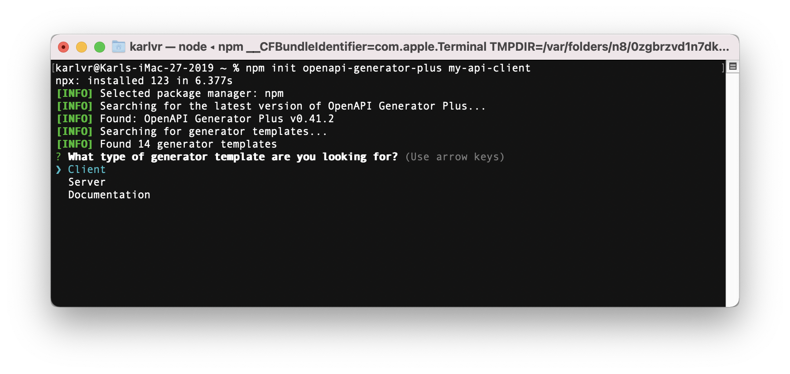
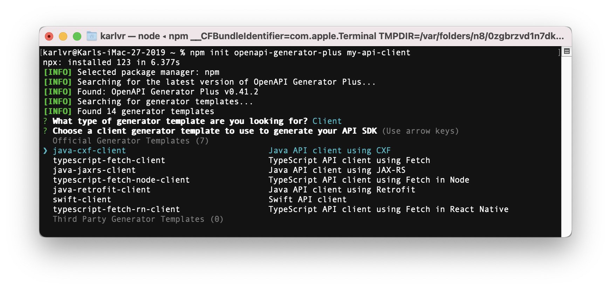
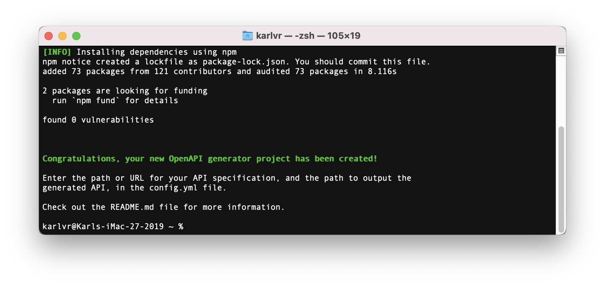
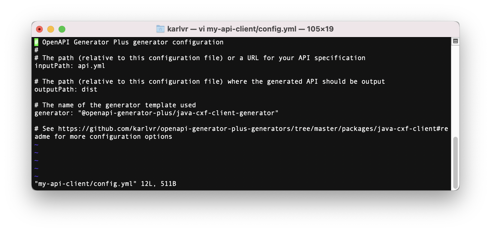

# OpenAPI Generator Plus

A code generator platform for OpenAPI 2.0 and 3.0 written in TypeScript and Node.js, with modular language-specific generator templates.

## Quick start

To create a new project to generate an API client or server in the current working directory:

```shell
npm init openapi-generator-plus
```

The script searches for the latest generator templates [available on npmjs.com](https://www.npmjs.com/search?q=keywords:openapi-generator-plus-generator).

You must first choose the type of API library you want to generate:



You will then be prompted to choose from a list of appropriate generator templates:



The script will create a `package.json` and `config.yml`, install OpenAPI Generator Plus
and the generator template, and setup a build script.



Edit the `config.yml` to point to your API specification, and where you'd like to output the generated API.



Then generate your API.

```shell
npm run generate
```

Re-run that command any time your API specification changes, or you update OpenAPI Generator Plus.

See [create-openapi-generator-plus](https://github.com/karlvr/openapi-generator-plus/tree/master/packages/create)
for more options.

## Updating

New versions of OpenAPI Generator Plus and generator templates are released from time to time. Updating to
the latest version is the same as updating dependencies in any Node.js project.

We recommend updating using [`npm-check-updates`](https://www.npmjs.com/package/npm-check-updates) by running
these commands in the generator project directory:

```shell
npx npm-check-updates -u
npm install
```

Then regenerate:

```shell
npm run generate
```

## Using

OpenAPI Generator Plus exposes two subcommands: `generate` (the default) and `bundle`.

### Generate

Generate code from an API specification:

```shell
npx openapi-generator-plus [generate] [-c <config file>] [-o <output dir>] [-g <generator template name or path>] [<path or url to api spec> [<additional api spec> ...]]
```

You can also use a config file, which contains more advanced options to control the generated output:

```shell
npx openapi-generator-plus -c <config file>
```

When more than one input spec is supplied (either as multiple positional arguments or as an array `inputPath` in the config file) the specs are merged before generation using the same semantics as the `bundle` command described below.

### Bundle

Bundle one or more API specifications into a single file, with all external `$ref`s inlined. Useful for distributing a self-contained spec, or for combining several specs (e.g. one per service) into one document before generating:

```shell
npx openapi-generator-plus bundle [-c <config file>] [-o <output file or dir>] [<path or url to api spec> [<additional api spec> ...]]
```

If `-o` is omitted the bundled spec is written to stdout. The output format is YAML, or JSON if the output file ends in `.json`. If the output path is a directory (or ends in `/`), the bundle is written into that directory using the basename of the first input.

`bundle` also accepts `-c <config file>` to load `inputPath` (a single path or array), `outputPath`, filter flags, `activatePatches`, and `removeExtensions` from a config file (see [Configuration](#configuration)). Positional inputs and `-o` on the command line override the config file.

When more than one input is supplied the specs are merged with last-wins semantics: top-level metadata (`info`, version, servers, etc.) is taken from the first document, while `paths`, `components.*` (or v2 buckets like `definitions`), and `tags` are unioned across all inputs. Collisions on the same key are reported as warnings and the later input's value wins. All inputs must use the same major OpenAPI version.

The same merging behaviour applies to the `generate` command when multiple inputs are supplied.

Filtering and `--activate-patch` flags (described below) are also supported by `bundle`, and are applied to the merged document before it is written. `bundle` additionally accepts `--remove-extension <pattern>` to strip vendor extensions from the output (see [Removing vendor extensions](#removing-vendor-extensions)).

## Generator template

OpenAPI Generator Plus requires a generator template in order to generate code in your target language and style.

You can find generator templates by searching for the [#openapi-generator-plus-generator](https://www.npmjs.com/search?q=keywords:openapi-generator-plus-generator) keyword on npm.

For example, to install a generator for a [Java server using the CXF library with CDI](https://github.com/karlvr/openapi-generator-plus-generators/tree/master/packages/java-cxf-cdi-server):

```shell
npm install --save-dev @openapi-generator-plus/java-cxf-cdi-server-generator
```

### Using a generator template

Each generator template has different configuration, which you can determine from the generator's README.

First try running without any configuration:

```shell
npm openapi-generator-plus -o build -g @openapi-generator-plus/java-cxf-cdi-server-generator api.yml
```

### Command-line options

Options to the generation process can be specified on the command-line or in a configuration file.

|Option|Description|
|------|-----------|
|`-c <path>`|The path to a configuration file to load (see below).|
|`-o <path>`|The path to the output directory (or output file when bundling).|
|`-g <module or path>`|The module name of or path to a generator template.|
|`<path>`|The path to the input API specification. Both `generate` and `bundle` accept multiple paths, in which case the specs are merged before processing.|
|`--watch`|Watch the input spec and any generator-supplied watch paths and regenerate on change. (`generate` only.)|
|`--clean`|After a successful generation, remove files under the output directory that match the generator's clean patterns and were not written by this run. (`generate` only.)|
|`--include-tag <tag>`|Keep only operations tagged with the given tag. Repeatable, or comma-separated.|
|`--exclude-tag <tag>`|Drop operations tagged with the given tag. Repeatable, or comma-separated.|
|`--include-path <glob>`|Keep only operations whose path matches the given glob. Repeatable, or comma-separated.|
|`--exclude-path <glob>`|Drop operations whose path matches the given glob. Repeatable, or comma-separated.|
|`--activate-patch <name>`|Promote `x-<name>-<key>` vendor extension keys to `<key>` throughout the spec before generation. Repeatable, or comma-separated.|
|`--remove-extension <pattern>`|Strip vendor extensions whose suffix (the part after `x-`) matches the given glob pattern. (`bundle` only.) Repeatable, or comma-separated.|

Command-line options override their respective configuration options (see below). When a filter or `--activate-patch` flag appears on the command line it fully replaces the matching configuration value rather than appending to it.

### Filtering operations

The filter flags (`--include-tag`, `--exclude-tag`, `--include-path`, `--exclude-path`) and their config equivalents (`includeTags`, `excludeTags`, `includePaths`, `excludePaths`) prune operations from the spec before generation or bundling. They are useful for splitting a large spec into multiple generated outputs (e.g. one client per tag), or for excluding internal or experimental endpoints.

- An operation is kept when it matches every active include filter and does not match any exclude filter.
- Tag filters match an operation's tags exactly.
- Path filters use [glob syntax](https://github.com/isaacs/minimatch) against the OpenAPI path string, so `/users/*` matches `/users/{id}` and `/users/**` matches any descendant path.
- After filtering, paths and tags with no remaining operations are removed, and `components`/`definitions` entries that are no longer reachable from any retained operation are pruned.

#### Extended filtering with `x-tags`

You can add tags to parts of the schema that don't otherwise support tags using an `x-tags: [<tag>, ...]` extension (a single string is also accepted) in order to have those parts effected by tag filters. This is supported on parameters, schema properties, request bodies, response codes, and media-type variants.

On an operation, `x-tags` is combined with the operation's `tags`. This lets you tag an operation for filtering without touching the documentation-facing `tags` array.

### Activating patches

`--activate-patch <name>` (or the `activatePatches` config option) promotes any `x-<name>-<key>` vendor extension to `<key>`, replacing whatever was at that key. This lets a single spec carry alternate values for client vs. server, internal vs. public, etc., and select the right variant at generation time.

For example, with `--activate-patch server`:

```yaml
servers:
  - url: https://api.example.com
    x-server-url: http://localhost:8080
```

becomes:

```yaml
servers:
  - url: http://localhost:8080
```

Multiple `--activate-patch` flags are applied in order, and each pass walks the document recursively, so nested extensions on the same name are promoted in a single invocation.

### Removing vendor extensions

`--remove-extension <pattern>` (available on `bundle` only) deletes vendor extension keys whose suffix — the portion after `x-` — matches the given pattern. Patterns support `*` as a wildcard; all other characters match literally.

For example, `--remove-extension server-*` strips every `x-server-*` key from the bundled output, while leaving the rest of the spec untouched. `--remove-extension '*'` removes every vendor extension. The flag is repeatable and comma-separated, and is applied after `--activate-patch` so any extensions promoted to first-class keys are preserved.

### Configuration

The configuration file may be YAML or JSON. A basic configuration file contains:

|Property|Type|Description|Default|
|--------|----|-----------|-------|
|`inputPath`|`string` \| `string[]`|The path to the input API specification, relative to the config file. May be an array of paths, in which case the specs are merged before processing (see [Generate](#generate) and [Bundle](#bundle)).|`undefined`|
|`outputPath`|`string`|The path to the output directory, relative to the config file.|`undefined`|
|`generator`|`string`|The name of the generator template, or the path relative to the config file for the generator template module.|`undefined`|
|`options`|`Options`|Additional options to control the generation.|`undefined`|
|`includeTags`|`string[]`|Keep only operations tagged with any of these tags. See [Filtering operations](#filtering-operations).|`undefined`|
|`excludeTags`|`string[]`|Drop operations tagged with any of these tags.|`undefined`|
|`includePaths`|`string[]`|Keep only operations whose path matches any of these globs.|`undefined`|
|`excludePaths`|`string[]`|Drop operations whose path matches any of these globs.|`undefined`|
|`activatePatches`|`string[]`|Names to pass to [Activating patches](#activating-patches) before generation.|`undefined`|
|`removeExtensions`|`string[]`|Patterns to pass to [Removing vendor extensions](#removing-vendor-extensions). (`bundle` only.)|`undefined`|

See the README for the generator template you're using for additional configuration options supported by that generator.

#### Options

|Property|Type|Description|Default|
|--------|----|-----------|-------|
|`operations`|`Operations`|Options specific to generation of operations|`undefined`|

#### Operations

|Property|Type|Description|Default|
|--------|----|-----------|-------|
|`defaultRequestBodyIdentifier`|`string`|The identifier to use for the request body (OpenAPI 3)|`"request"`|
|`groupBy`|`"path"` \| `"tag"` \| `"default"`|The strategy for grouping operations. The default is to use tags, if present on an operation and to fallback to paths. If a specific strategy is specified, only that strategy will be used.|`"default"`|

## Background

OpenAPI Generator Plus is a reimplementation of code generation for OpenAPI specifications, following
in the footsteps of
[swagger-codegen](https://github.com/swagger-api/swagger-codegen) and
[openapi-generator](https://github.com/OpenAPITools/openapi-generator).

OpenAPI Generator Plus is written in TypeScript and uses Node.js. It aims to provide a strong core to transform API specifications for code generation,
and to rely on separate code generation modules for the final code generation step. This separation enables the templates and
minimal code required for each new language to be developed, packaged and published _independently_, making customisation more powerful
and easily accessible for the community to use and to be involved.

## Operation grouping

API operations are grouped by the generator template. The usual mode of operation is to work out the name
of the group by:

1. A vendor extension `x-group` on the operation or path.
2. The first tag on the operation.
3. The first path component.

## Vendor extensions

OpenAPI Generator Plus supports the following vendor extensions:

|Extension|Context|Description|
|---------|-------|-----------|
|x-group|Operation|Override the operation group name.|
|x-no-client|Operation, Schema|Don't output when generating client code.|
|x-no-server|Operation, Schema|Don't output when generating server code.|
|x-schema-name|Schema|Override the name of the generated code for a schema.|
|x-discriminator-mapping|Schema, oneOf, anyOf|Specify discriminator mappings in OpenAPI v2|
